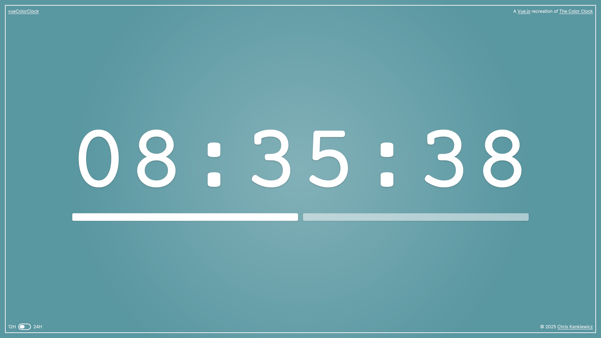

vueColorClock
=============

    

  
  
  
  

    A <a href="https://vuejs.org">Vue.js</a> clone of <a href="http://thecolourclock.co.uk/">The Colour Clock</a>, a color changing clock.
    -- by, <a href="https://www.ChrisKankiewicz.com">Chris Kankiewicz</a> (<a href="https://twitter.com/PHLAK">@PHLAK</a>)

Requirements
------------

  - [Node.js](https://nodejs.org)

Building
--------

### Install dependencies

    npm install

### Build for local development

    npm run development

or recompile on changes with

    npm run watch

### Build for production

    npm run production

Copyright
---------

This project is licensed under the [MIT License](https://github.com/PHLAK/vueColorClock/blob/master/LICENSE).
